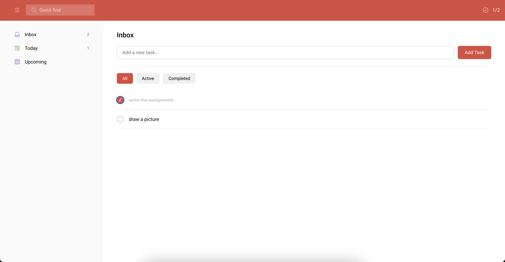
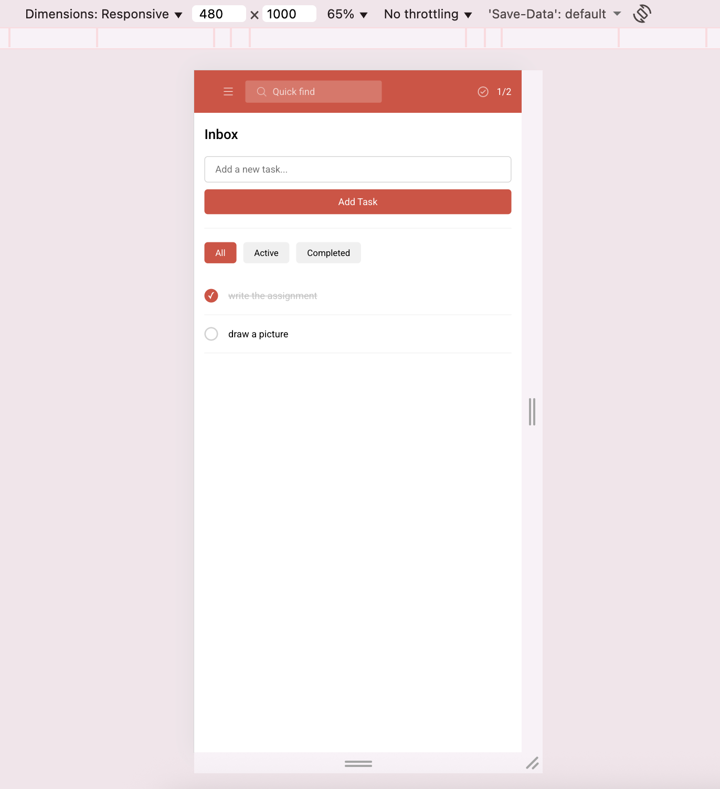
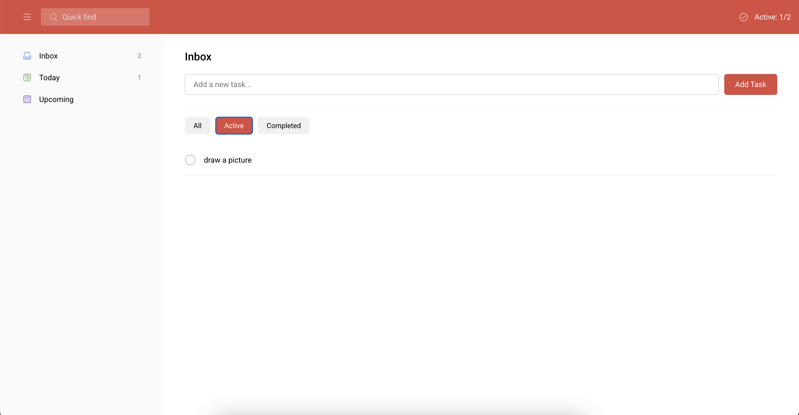
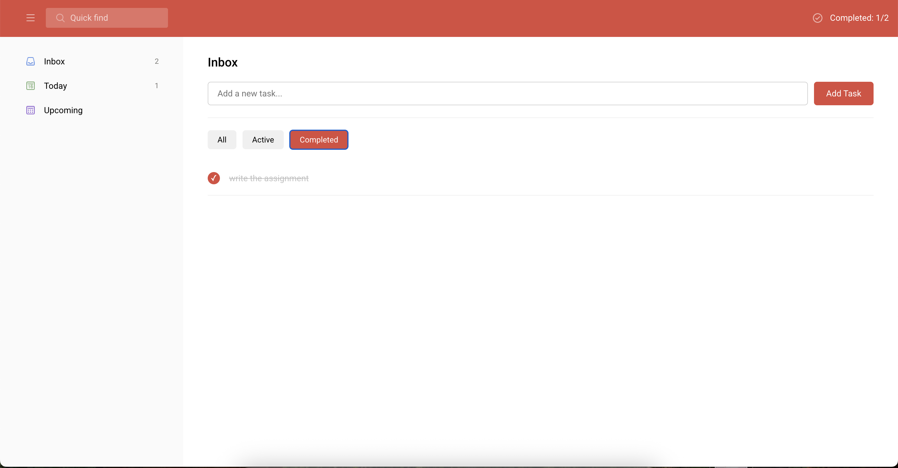
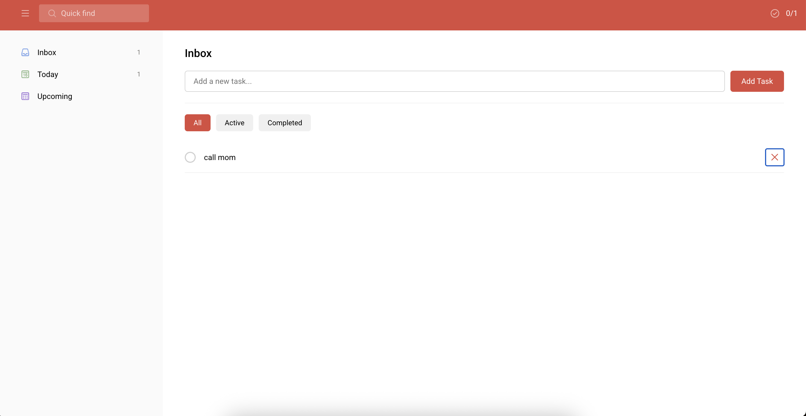

# Results

## Application Screenshots

### Responsive Design





### Active/Completed Filter





### Deleting Tasks




---

# Assignment 2: React Task Manager
## INFO 153A/253A Front-End Web Architecture - Fall 2025

**Points:** 100 points  
**Individual Assignment**

---


## Overview

Convert your Assignment 1 Task Manager from HTML/CSS to a fully interactive React application. This version focuses on core React concepts without overwhelming complexity.


---

## Learning Objectives

By completing this assignment, you will:
- Convert static HTML to React components
- Understand JSX syntax and component structure
- Implement state management with useState
- Handle user events in React
- Build controlled form components
- Practice component composition and props

---

## Requirements

### Core Features (Required - 85 points)

#### 1. Component Structure (20 points)
Create the following React components:
- `App` - Main application container
- `TaskList` - Displays list of tasks
- `TaskItem` - Individual task display
- `TaskForm` - Form for adding new tasks
- `TaskCounter` - Shows task statistics

#### 2. Task Management (25 points)
- **Add Task**: Users can add new tasks via form input
- **Complete Task**: Click checkbox to mark task as complete/incomplete
- **Delete Task**: Remove tasks from the list
- **Task Counter**: Display total tasks and completed count

#### 3. React State Management (25 points)
- Use `useState` to manage the tasks array
- All task data stored in App component state
- Pass data down via props
- Pass callback functions for state updates

#### 4. User Interface (15 points)
- Clean, responsive design that matches Assignment 1 styling
- Proper form handling with controlled components
- Visual distinction between completed and active tasks
- Smooth user interactions

### Enhanced Feature: Task Filtering (Required - 15 points)

Implement task filtering functionality:
- Display three filter buttons: "All", "Active", and "Completed"
- Filter tasks based on completion status when buttons are clicked
- Highlight the currently active filter button
- Update task counter to reflect the filtered view (e.g., "3 of 5 tasks" when showing completed)
- Default filter should be "All" showing all tasks

---

## Technical Requirements

### React Fundamentals
```jsx
// Example component structure
function App() {
  const [tasks, setTasks] = useState([]);
  
  const addTask = (taskText) => {
    // Add new task to state
  };
  
  const toggleTask = (id) => {
    // Toggle task completion
  };
  
  const deleteTask = (id) => {
    // Remove task from state
  };
  
  return (
    <div className="app">
      <TaskForm onAddTask={addTask} />
      <TaskCounter tasks={tasks} />
      <TaskList 
        tasks={tasks} 
        onToggle={toggleTask}
        onDelete={deleteTask}
      />
    </div>
  );
}
```

### Data Structure
```javascript
// Task object structure
const task = {
  id: 1, // unique identifier
  text: "Learn React", // task description
  completed: false // completion status
};
```

### Styling Requirements
- Reuse your Assignment 1 CSS (copy to React project)
- Maintain responsive design
- Use className instead of class
- Keep visual consistency with original design

---

## Assignment Scope

This assignment focuses on React fundamentals:

✅ **Component-based architecture** - Break UI into reusable components
✅ **useState hook** - Manage application state
✅ **Props and data flow** - Pass data between components
✅ **Event handling** - Respond to user interactions
✅ **Controlled components** - Manage form inputs with React state

---

## Getting Started

### Step 1: Setup React Project
```bash
# Create new Vite project with React template
npm create vite@latest task-manager-react -- --template react

# Navigate to project directory
cd task-manager-react

# Install dependencies
npm install

# Start development server
npm run dev
```

Your app will be running at `http://localhost:5173`

### Step 2: Project Structure
```
task-manager-react/
├── index.html          # Root HTML file (in root, not public/)
├── package.json
├── vite.config.js
└── src/
    ├── main.jsx        # Entry point (not index.js!)
    ├── App.jsx         # Main component
    ├── App.css
    └── components/
        ├── TaskList.jsx
        ├── TaskItem.jsx
        ├── TaskForm.jsx
        └── TaskCounter.jsx
```

### Step 3: Create Component Files
```bash
# Create components directory
mkdir src/components

# Create your component files
touch src/components/TaskForm.jsx
touch src/components/TaskCounter.jsx
touch src/components/TaskList.jsx
touch src/components/TaskItem.jsx
```

### Step 4: Development Approach
1. **Start with hard-coded data** - Test your components with sample tasks first
2. **Build component structure** - Get all components rendering before adding state
3. **Add state management** - Implement useState in App.jsx
4. **Connect event handlers** - Wire up add, toggle, delete functions
5. **Implement filtering** - Add filter buttons and logic
6. **Style and polish** - Copy your Assignment 1 CSS and adapt for React

---

## Implementation Guide

This guide provides concepts and hints to help you build the task manager. Try to solve each part yourself before looking at hints!

### Setting Up State in App.jsx

You'll need two pieces of state:

1. **Tasks array** - Stores all your tasks
   - Initial value: empty array `[]`
   - Each task is an object with: `id`, `text`, `completed`

2. **Filter string** - Tracks which filter is active
   - Initial value: `'all'`
   - Possible values: `'all'`, `'active'`, `'completed'`

```jsx
import { useState } from 'react'

function App() {
  // TODO: Add your state here using useState
}
```

### Task Data Structure

Each task object should have these properties:
- `id` - Unique identifier (Hint: `Date.now()` or `crypto.randomUUID()`)
- `text` - The task description (string)
- `completed` - Boolean for completion status

### Key Functions to Implement in App.jsx

**1. Adding Tasks**

Think about:
- Creating a new task object with a unique id
- The completed property should start as `false`
- Adding the new task to the existing array (remember: don't mutate state!)

Hint: Use the spread operator `[...tasks, newTask]` to create a new array

**2. Toggling Tasks (Marking Complete/Incomplete)**

Think about:
- Finding the task by id
- Flipping its `completed` boolean
- Creating a new array with the updated task

Hint: `.map()` can create a new array where you transform one element

**3. Deleting Tasks**

Think about:
- Removing a task by its id
- Creating a new array without that task

Hint: `.filter()` creates a new array with only items that pass a test

**4. Filtering Tasks**

Think about:
- Based on the filter state, return different subsets of tasks
- 'all' → return everything
- 'active' → return tasks where completed is false
- 'completed' → return tasks where completed is true

Hint: Use if statements and `.filter()` to return different arrays

### Building Components

**TaskForm Component**

This component needs:
- Its own local state for the input value (controlled component)
- A form with onSubmit handler
- An input with value and onChange props
- Validation to prevent empty tasks
- Clear the input after submission

Key concepts:
- `e.preventDefault()` stops form from refreshing page
- Controlled components: input value comes from state
- Call the `onAddTask` prop function with the text
- Use `.trim()` to check for empty/whitespace-only input

**TaskItem Component**

This component receives a task via props and displays:
- A checkbox (type="checkbox") that calls onToggle when changed
- The task text with conditional styling
- A delete button that calls onDelete when clicked

Key concepts:
- Use `checked={task.completed}` for checkbox
- Apply a CSS class conditionally for completed tasks
- Pass `task.id` when calling the handler functions

**TaskList Component**

This component receives filtered tasks and handlers via props.

Think about:
- What should render when the tasks array is empty?
- How do you render multiple TaskItem components?
- What prop is required when rendering lists in React?

Key concepts:
- Use `.map()` to transform array of tasks into array of components
- Each component in a list needs a unique `key` prop
- Pass down the handler functions as props

**TaskCounter Component**

This component calculates and displays statistics.

Think about:
- How to count total tasks (array length)
- How to count completed tasks (use `.filter()`)
- How to calculate active tasks (total - completed)

Display these three numbers in your UI.

### Filter Buttons

Think about:
- Rendering three buttons for 'all', 'active', 'completed'
- Each button should update the filter state when clicked
- The active button should have a special CSS class
- Use conditional logic to apply the 'active' class

Hint: Use a ternary operator `className={filter === 'all' ? 'active' : ''}`

### React Concepts You'll Use

**State Management:**
- `useState()` hook for managing data
- Never mutate state directly - always create new arrays/objects
- Use setter functions to update state

**Props:**
- Pass data down from parent to child components
- Pass functions down so children can communicate back up
- Destructure props in function parameters: `function TaskForm({ onAddTask })`

**Event Handling:**
- onClick for buttons
- onChange for inputs
- onSubmit for forms
- Always pass a function, not a function call: `onClick={handleClick}` not `onClick={handleClick()}`

**Controlled Components:**
- Input value comes from state
- onChange updates that state
- This gives React control over the input

**Lists and Keys:**
- Use `.map()` to render arrays of components
- Always provide a unique `key` prop
- Keys help React track which items changed

### Common React Patterns

**Creating new arrays (don't mutate):**
```jsx
// Add to array
const newArray = [...oldArray, newItem];

// Update item in array
const newArray = oldArray.map(item =>
  item.id === targetId ? { ...item, updated: true } : item
);

// Remove from array
const newArray = oldArray.filter(item => item.id !== targetId);
```

**Conditional rendering:**
```jsx
// Show different content based on condition
{tasks.length === 0 ? <EmptyMessage /> : <TaskList />}

// Conditional CSS class
<div className={isActive ? 'active' : ''}>
```

**Passing functions with parameters:**
```jsx
// When you need to pass an argument to a handler
onClick={() => handleDelete(task.id)}

// Not just onClick={handleDelete} because we need to pass the id
```

---

## Grading Rubric (100 points)

### Component Structure (20 points)
- At least 4 separate component files created - **5 points**
- Proper component hierarchy (App → TaskList → TaskItem) - **5 points**
- Clean separation of concerns between components - **5 points**
- Props passed correctly between components - **5 points**

### Task Management Functionality (25 points)
- Add new task functionality works - **7 points**
- Mark task as complete/incomplete works - **6 points**
- Delete task functionality works - **6 points**
- Task counter updates correctly - **3 points**
- Empty state message displays when no tasks - **3 points**

### React State Management (25 points)
- useState hook implemented correctly - **8 points**
- State updates immutably (no direct mutations) - **7 points**
- Event handlers properly bound and working - **5 points**
- Form is controlled component with proper state - **5 points**

### User Interface & Styling (15 points)
- Reuses Assignment 1 CSS effectively - **5 points**
- Responsive design maintained from Assignment 1 - **3 points**
- Visual feedback for user interactions (hover, active states) - **3 points**
- Completed tasks visually distinct (strikethrough, opacity, etc.) - **2 points**
- Clean, professional appearance - **2 points**

### Enhanced Feature: Task Filtering (15 points)
- Filter buttons render and respond to clicks - **5 points**
- Tasks filter correctly based on completion status - **5 points**
- Active filter button is visually highlighted - **3 points**
- Task counter updates to reflect filtered view - **2 points**

---

## Submission Requirements - MODIFIED 10/27/25

### What to Submit
1. **Github URL** Submit github URL in bcourses

NO NEED TO DEPLOY

---

## Tips for Success

### Development Strategy
1. **Start Simple**: Get basic components rendering first
2. **One Feature at a Time**: Don't try to implement everything at once
3. **Use React DevTools**: Install browser extension for debugging
4. **Test Frequently**: Check your app after each small change

### Common Mistakes to Avoid
- Don't mutate state directly (use setter functions)
- Remember to use `key` props in lists
- Use controlled components for form inputs
- Don't forget to handle edge cases (empty lists, etc.)

### React Patterns to Use
```jsx
// Conditional rendering
{tasks.length === 0 ? <p>No tasks yet!</p> : <TaskList tasks={tasks} />}

// List rendering
{tasks.map(task => <TaskItem key={task.id} task={task} />)}

// Event handling
<button onClick={() => deleteTask(task.id)}>Delete</button>

// Task filtering pattern
const [filter, setFilter] = useState('all');

const filteredTasks = tasks.filter(task => {
  if (filter === 'active') return !task.completed;
  if (filter === 'completed') return task.completed;
  return true; // 'all'
});

// Render filtered tasks
{filteredTasks.map(task => <TaskItem key={task.id} task={task} />)}
```

---

## Resources

### Required Reading
- React Front to Back Sections 1-6 (Components, Props, State, Events)
- React Official Documentation: "Thinking in React"

### Helpful Tools
- React Developer Tools (browser extension)
- VS Code ES7+ React/Redux/React-Native snippets
- Vite documentation: https://vitejs.dev/guide/

### Getting Help
- Office hours for debugging sessions
- Class discussion for conceptual questions
- React documentation for syntax reference

---

## FAQ

**Q: Can I add extra features beyond the task filtering?**
A: Yes, but focus on doing the core requirements and filtering excellently first.

**Q: How should the task counter work with filtering?**
A: When showing "Active", display count of active tasks. When showing "Completed", display count of completed tasks. When showing "All", display total count.

**Q: Do I need to match the exact visual design from Assignment 1?**
A: Close visual similarity is expected, but small improvements are welcome.

**Q: What if I'm struggling with React concepts?**
A: Come to office hours! This assignment is designed to be manageable with the course prep.

**Q: Can I use external libraries?**
A: Stick to vanilla React for learning purposes. No additional libraries needed.

---

*This simplified assignment focuses on React fundamentals while providing a solid foundation for more advanced concepts in future courses.*
